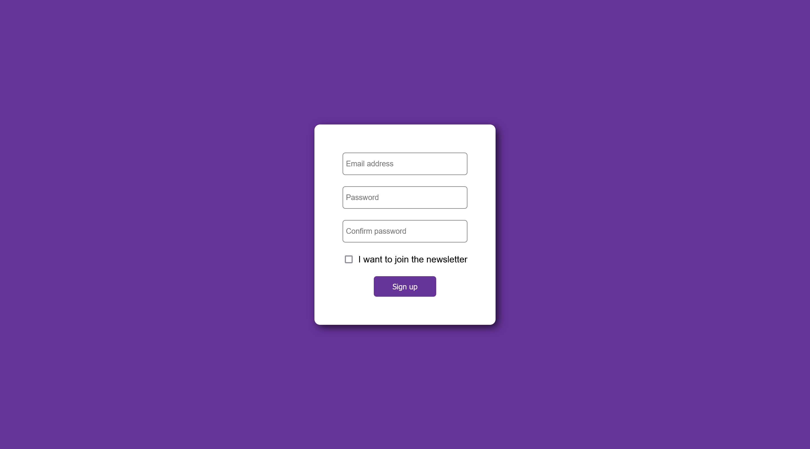

# About

Simple sign-up form using ReactJS. No API/route/credential-verification is included.

Within the code we are console-logging the different outcomes

# Screenshot 

# Problems and Solutions
<h3>Problem #1: Error message: "Warning: Received `true` for a non-boolean attribute `check`"</h3>
<h3>Solution: After quickly reviewing the code, "checked", was to be used regarding the newletter checkbox</h3>

checked={formData.okayToEmail} // rename "check" to "checked"

<h3>Problem #2: "A component is changing an uncontrolled input to be controlled. This is likely caused by the value changing from undefined to a defined value, which should not happen. Decide between using a controlled or uncontrolled input element for the lifetime of the component"</h3>
<h3>Solution: The error message indicates that an input element is being changed from an uncontrolled component to a controlled component. This can happen if the value of an input element is initially set to undefined or null, and then later changed to a defined value. To fix this error, you need to ensure that the value of the input element is defined when the component is mounted.</h3>

Instead of value={formData.confirmPassword} - The revised code: value={formData.confirmPassword || ''} // add default value here

